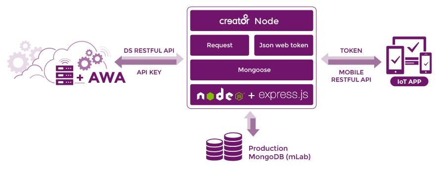

# Kiwano Webapp (Project 4)

The Webapp codenamed - **Kiwano** is a system component, part of the Creator IoT 
Project 4 - Temperature 
Logger.  
The application developed in [Node.js](https://nodejs.org/en/) is hosted in 
[Heroku](https://www.heroku.com/), a Platform as a Service (Paas). The application 
uses a MongoDB database, hosted in the cloud - [mLab](https://mlab.com/), 
therefore providing data cloud storage.  
Kiwano is a middle tier Webapp, which consumes the Device Server REST API and it's
resources, fetching for connected devices (clients) and it's temperature values.
Finaly the Webapp provides a RESTAPI to consume the DataBase, in Project 4 it's 
used an Android Mobile App, but another REST client could also be used. 

---

## Webapp Architecture



## Jump Start

There are two ways to use the Webapp:

1. Cloud Deployment
2. Locally

The application, uses a **jwt access token** (x-access-token). You can encode 
your secret using: [https://jwt.io/](https://jwt.io/).

**Note:** Change the name of **template_config.js** to **config.js**. 

---

## Cloud Deployment

This guide exaplains the process of cloud deploying the Webapp in Heroku and mLab,
using their free tiers. However the performance can be improved using a payed service,
or if you prefer different hosting services: AWS, Google Cloud, etc.

### 1. Developer Console - Create Account

1. Create a [Developer Console](https://console.creatordev.io) account  
2. Generate a set of API Keys
3. Insert the API Keys into the **config.js file**, located on your projects root 
folder

### 2. Heroku - Push The Webapp Source Code

1. Create an [Heroku account](https://www.heroku.com/)
2. Install [Heroku Command Line Interface (CLI)](https://devcenter.heroku.com/articles/heroku-command-line)
3. Enter your Heroku credentials: **$ heroku login** 
4. Create the application on Heroku: **$ heroku create**
5. Deploy the application on Heroku: **$ git push heroku master** 
6. Test the live application: **$ heroku open**

### 3. mLab - Create the DB (Manual Setup)

1. Sign up for an [mlab free account](https://mlab.com/) 
2. Create a new database (select Single Node, Sandbox for the free tier)
3. Add a user
4. Get the database URI (connection string) visible on the dashboard:   
mongodb://`<`dbuser`>`:`<`dbpassword>@`<`dbuser`>`.mlab.com:`<`port`>`/`<`db_name`>`  
5. Complete the connection string with your account details. Save the connection 
string as mongo db configuration: **$ heroku config:set MONGOLAB_URI=your_db_uri**

---

## Start The Web App (Locally)

1. Get the project, by ZIP download or git clone
2. Install [**Node.js LTS**](https://nodejs.org/en/)
3. Install the Webapp's dependencies. On projects root directory, execute: 
**$ npm install**  
4. Insert the API Keys into the **config.js file**, located in your projects root 
folder.
5. Install MongoDB
6. Use a **proxy** (e.g. Ngrok) to expose the local application on an https server
7. Start the application: **$ npm start**

--- 

## REST Endpoints 

| HTTP Method | URL Path 	          | Description                                       | Example                                        |
|:------------| :-------------------|:--------------------------------------------------|:-----------------------------------------------|
| GET         | /	  			          | Retrieves REST API links                          | http://localhost:3000/api/v1/                  |
| GET         | /clients	  			  | Retrieves all clients list                        | http://localhost:3000/api/v1/clients           |
| GET, PUT    | /clients/{ID}       | Retrieves and manages specific client information | http://localhost:3000/api/v1/clients/123       |
| GET         | /clients/{ID}/data  | Retrieves specific client data                    | http://localhost:3000/api/v1/clients/123/data  |
| GET, PUT    | /clients/{ID}/delta	| Retrieves and manages specific client delta       | http://localhost:3000/api/v1/clients/123/delta |
| DELETE      | /dropdb             | Deletes measurements                              | http://localhost:3000/api/v1/dropdb            |
| POST        | /notification       | Receives notifications from the DS                | http://localhost:3000/api/v1/notification      |

### Description
* client - Data source (sensor), in this example - **Temperature Sensor**
* ID - Unique hex identifier for each client
* Delta - Interval between temperature samples
* Data - Temperature (in this example)

### Generate RESTAPI Documentation

You can generate documentation using [APIDOCS](http://apidocjs.com/). Install
and execute:

```bash
$ npm install apidoc -g
$ apidoc -i ./api_v1

```

---

## Support

Need help or you have suggestions? Find a quick answer to your question at: 
[forum.creatordev.io](https://forum.creatordev.io/).

--- 